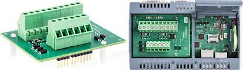

# node-red-contrib-iot2000

Nodes for Simatic IOT2000 io shield.

© Siemens AG

## Installation

       Please install node-red-contrib-iot2000 globally on iot2000.
       Local or node-red palette manager installation don't work.
       IOT2000 must connected to internet (LAN or WLAN).
         
       npm install -g node-red-contrib-iot2000
        
       For update node:
         
       npm update -g node-red-contrib-iot2000
         
       Or download zip file from GitHub and copy folder **node-red-contrib-iot2000** 
       to /usr/lib/node_modules/ and restart IOT2000. 

## Nodes

**io shield di:** Reads from IOT2000 io shield digital input.

**io shield do:** Controls IOT2000 io shield digital output.

**io shield ai:** Reads from IOT2000 io shield analog input.

**single pulse:** Send pulse messages.

## Copyright and license

Copyright 2017 D. Yolcubal. under [the Apache 2.0 license](LICENSE).

**SIMATIC** and **SIMATIC IOT2000** are trademark of Siemens AG.

More Nodes soon on https://github.com/sblyolcubal
